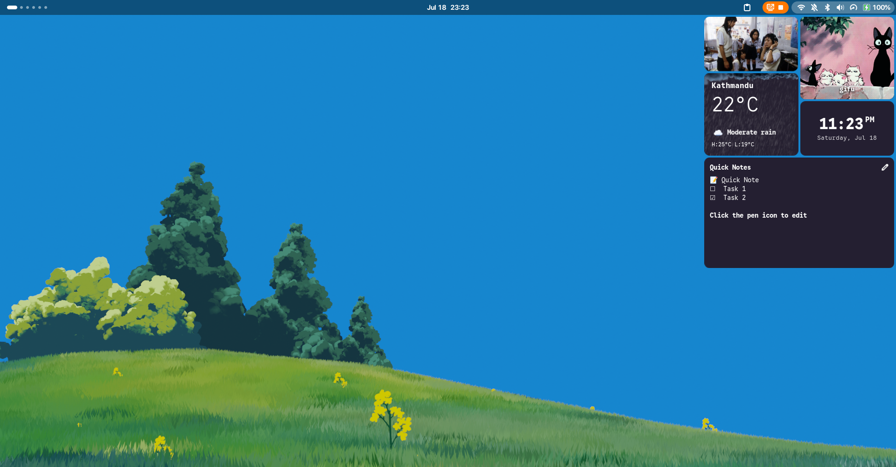
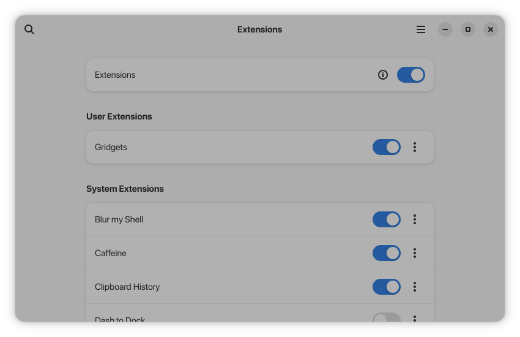

# Gridgets


A grid-based desktop widget extension for GNOME Shell.

Gridgets brings customizable, interactive widgets directly to your desktop. You can place images, animated GIFs, weather forecasts, digital clocks, system monitors, sticky notes, media players, and more onto a configurable grid. Each widget can be independently dragged, resized, and stylized to create your perfect desktop experience.

## 🌟 Features

- **Dynamic Grid Layout:** Snap widgets to a responsive desktop grid.
- **Vast Widget Library:** Includes Time & Date, Weather, Pomodoro, Music, CPU/RAM, Network Speed, Slideshows, and Custom Bash Commands.
- **Deep Customization:** Adjust background colors, text colors, fonts, border radii, and custom border widths for every individual widget.
- **High Performance:** Utilizes a centralized background polling engine to minimize system resource usage and maximize battery life.

## 📸 Screenshots

| Grid Layout | Widget Customization |
|-------------|----------------------|
|  |  |

## 🚀 Installation

### 1. From extensions.gnome.org (Recommended)
*Coming soon! Once the extension completes the official GNOME review process, you will be able to install it directly from the Extensions website in one click.*

### 2. Manual Installation (For developers and early adopters)

If you'd like to build from source or install manually:

**Option A: Direct Copy (Easiest)**

1. Download or clone this repository to your local machine.
2. Copy the entire folder into your GNOME Shell extensions directory:
   ```bash
   mkdir -p ~/.local/share/gnome-shell/extensions
   cp -r gridgets ~/.local/share/gnome-shell/extensions/gridgets@rebatnaath.github.com
   ```
3. Restart GNOME Shell:
   - **X11:** Press `Alt` + `F2`, type `r`, and hit `Enter`.
   - **Wayland:** Log out and log back in.
4. Enable the extension using the **Extensions** app or via the terminal:
   ```bash
   gnome-extensions enable gridgets@rebatnaath.github.com
   ```

**Option B: Build and Install via Zip**

1. Inside the project folder, pack the extension into a zip file:
   ```bash
   gnome-extensions pack --extra-source=assets/ --extra-source=desktopGrid.js --extra-source=gridgetClipboard.js --extra-source=gridgetCommand.js --extra-source=gridgetCpuRam.js --extra-source=gridgetGif.js --extra-source=gridgetImage.js --extra-source=gridgetMusic.js --extra-source=gridgetNetworkSpeed.js --extra-source=gridgetNotes.js --extra-source=gridgetPomodoro.js --extra-source=gridgetSlideshow.js --extra-source=gridgetTime.js --extra-source=gridgetWeather.js --extra-source=prefsHelpers.js --extra-source=systemMonitorEngine.js --extra-source=widgetEditUtils.js --extra-source=widgetUIUtils.js --extra-source=widgetUtils.js
   ```
2. Install the zip file:
   ```bash
   gnome-extensions install gridgets.zip
   ```
3. Restart GNOME Shell (Log out/in on Wayland, or `Alt+F2` -> `r` on X11) and enable it.

## ⚙️ Configuration

Once installed, you can configure the grid and customize individual widgets by opening the **Extensions** app and clicking the settings (gear) icon next to Gridgets.

## ✅ Compatibility

Supported GNOME Shell versions: `45`, `46`, `47`, `48`, `49`, `50`.

## 🙏 Acknowledgements

A special thanks to the following projects for providing excellent assets used in this extension:
- [SVG Repo](https://www.svgrepo.com/) for various vector icons.
- [Meteocons by basmilius](https://github.com/basmilius/meteocons) for the beautiful weather icons.
