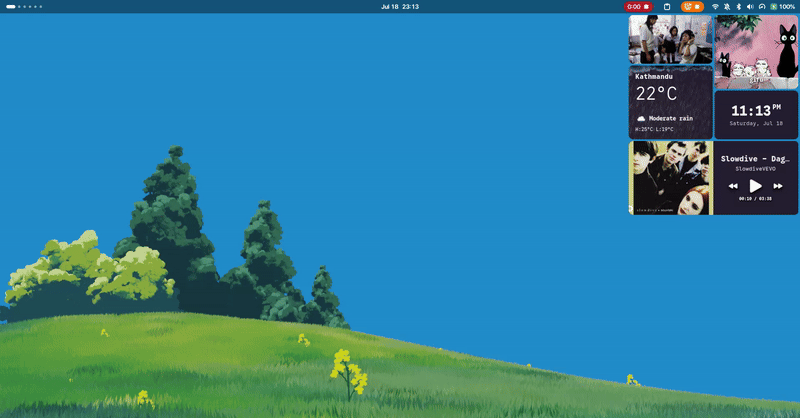
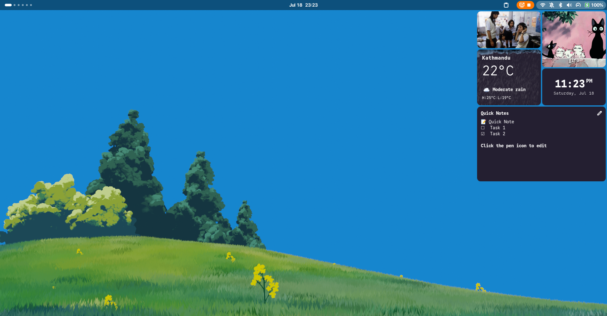
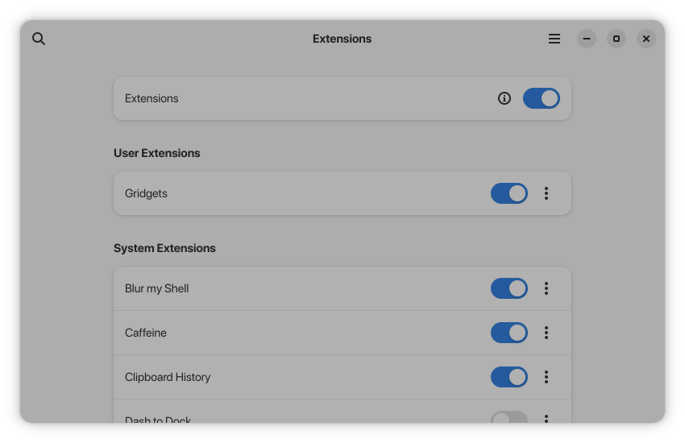

# Gridgets — GNOME Shell Widgets



**Gridgets is a GNOME widgets extension for GNOME Shell.** It lets you place widgets directly onto your desktop using a clean, responsive grid system — think Rainmeter for Windows or macOS desktop widgets, built right into your GNOME desktop.

You can add things like digital clocks, system monitors, weather forecasts, sticky notes, media controls, animated GIFs, and even custom bash command outputs. Each widget can be independently moved, resized, and styled to match your setup.

## 📖 User Guide

For a detailed walkthrough of all widgets, customization options, and desktop interactions, see the [User Guide](assets/github/user-guide/README.md).

## Features

- **Grid Alignment:** Snap widgets cleanly to a responsive desktop grid.
- **Built-in Widgets:** Time & Date, Weather, Pomodoro, Media Player, CPU/RAM, Network Speed, Image/GIF Slideshows, and Custom Bash Scripts.
- **Individual Styling:** Customize colors, fonts, border radii, and border widths for every widget.
- **Resource Efficient:** Uses a single background polling loop to keep CPU and battery usage minimal.

## Screenshots

| Grid Layout | Widget Preferences |
|-------------|--------------------|
|  |  |

## Installation

### Option A: From GitHub Releases (Easiest)

1. Download the latest release `.zip` file (`gridgets@rebatnaath.github.com.shell-extension.zip`) from the [Releases](https://github.com/rebatnaath/gridgets/releases) page.
2. Install it using the `gnome-extensions` CLI command:
   ```bash
   gnome-extensions install --force gridgets@rebatnaath.github.com.shell-extension.zip
   ```
   *(Note: The `--force` flag automatically overwrites any existing installation).*
3. Restart GNOME Shell:
   * **Wayland:** Log out and log back in.
   * **X11:** Press `Alt` + `F2`, type `r`, and press `Enter`.
4. Enable the extension:
   ```bash
   gnome-extensions enable gridgets@rebatnaath.github.com
   ```

---

### Option B: Manual Directory Copy (From Source)

If you cloned or downloaded the raw repository source:

1. Remove any previous installation directory to prevent leftover file conflicts:
   ```bash
   rm -rf ~/.local/share/gnome-shell/extensions/gridgets@rebatnaath.github.com
   ```
2. Copy the extension files into your GNOME extensions directory:
   ```bash
   mkdir -p ~/.local/share/gnome-shell/extensions/gridgets@rebatnaath.github.com
   cp -r . ~/.local/share/gnome-shell/extensions/gridgets@rebatnaath.github.com
   ```
3. Restart GNOME Shell (Log out/in on Wayland, or `Alt` + `F2` -> `r` on X11).
4. Enable the extension:
   ```bash
   gnome-extensions enable gridgets@rebatnaath.github.com
   ```

---

### Option C: Build and Install Zip Package

1. Package the extension inside the project directory:
   ```bash
   gnome-extensions pack \
   --extra-source=assets/close.svg \
   --extra-source=assets/resize.svg \
   --extra-source=assets/thumbnails \
   --extra-source=assets/weather \
   --extra-source=desktopGrid.js \
   --extra-source=prefs \
   --extra-source=schemas \
   --extra-source=utils \
   --extra-source=widgets \
   --extra-source=extension.js \
   --extra-source=prefs.js \
   --extra-source=metadata.json \
   --force   
   ```
2. Install the zip file (automatically overwriting previous versions):
   ```bash
   gnome-extensions install --force gridgets@rebatnaath.github.com.shell-extension.zip
   ```
3. Restart GNOME Shell and enable:
   ```bash
   gnome-extensions enable gridgets@rebatnaath.github.com
   ```

## ⚙️ Configuration

Open the **Extensions** (or Extension Manager) app and click the gear icon next to Gridgets to configure your grid settings and customize your widgets.

## Compatibility

Supported GNOME Shell versions: `45`, `46`, `47`, `48`, `49`, `50`.

## Acknowledgements

Thanks to these projects for providing assets used in this extension:

* [SVG Repo](https://www.svgrepo.com/) for vector icons.
* [Meteocons by basmilius](https://github.com/basmilius/meteocons) for the weather icons.


