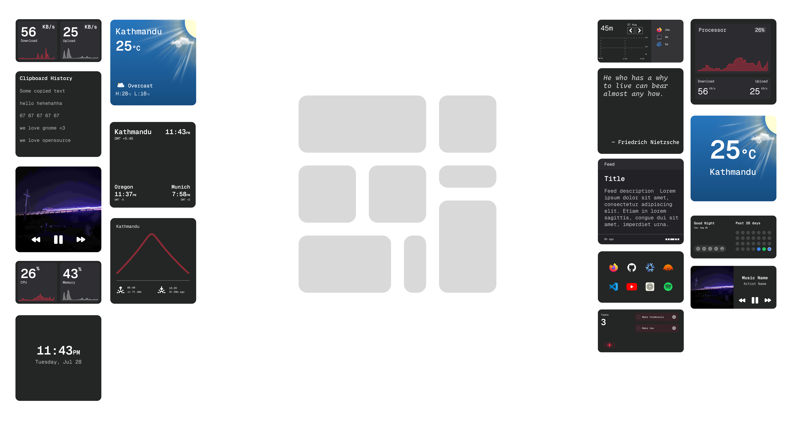
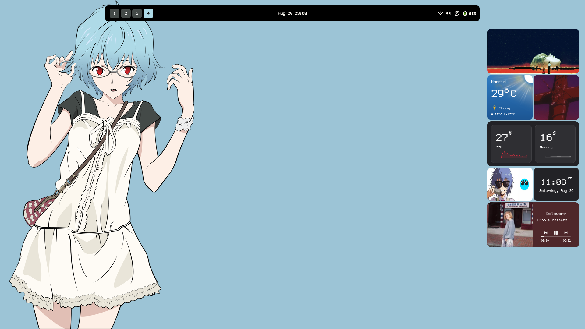
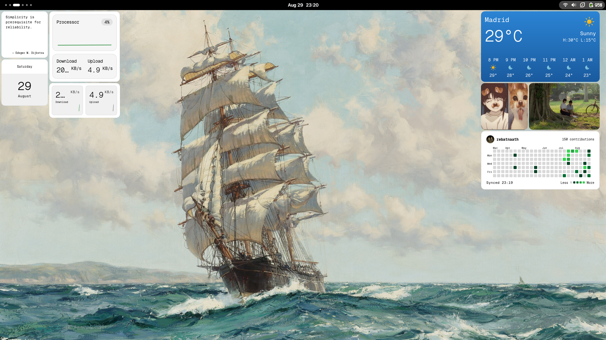
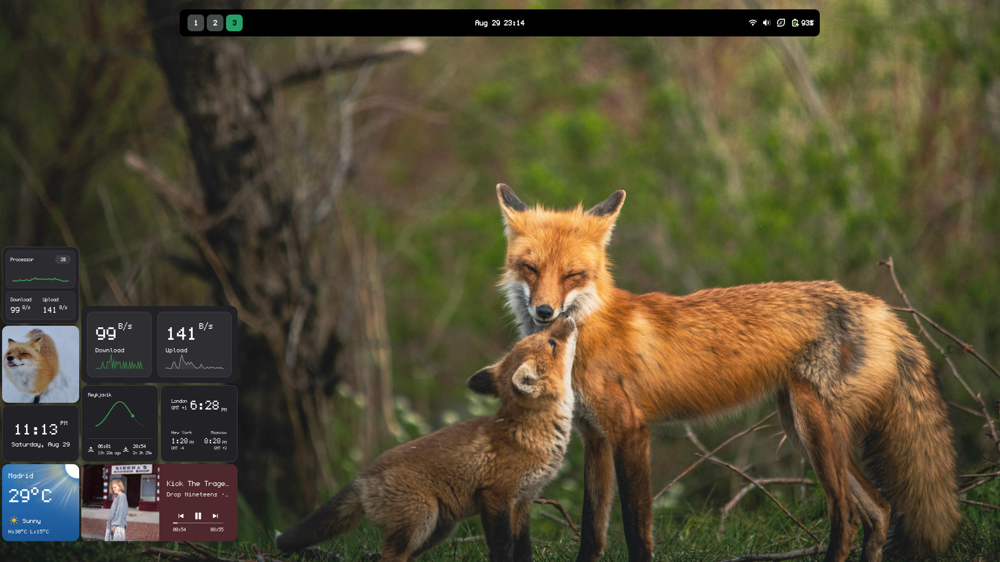

# Gridgets — GNOME Shell Widgets



| | | |
|---|---|---|
|  |  |  |

Gridgets is a GNOME Shell extension that places widgets directly on your desktop using a responsive grid layout. Add clocks, system monitors, weather forecasts, sticky notes, media controls, animated images, and more, then move, resize, and style each widget independently to match your setup.

<!-- ## User Guide

For a detailed walkthrough of all widgets, customization options, and desktop interactions, see the [User Guide](github/user-guide/README.md). -->

## Features

- **Grid Alignment:** Snap widgets cleanly to a responsive 50-column desktop grid.
- **24+ Built-in Widgets:** Weather, Time, Calendar, Music, System Monitor, Notes, Clipboard, Pomodoro, Tasks, GitHub, RSS, Mood, Images, and more.
- **Individual Styling:** Customize colors, fonts, border radii, and sizes for every widget.
- **Size Presets:** Quick S/M/L sizing from the right-click context menu.
- **Drag & Resize:** Move widgets by dragging, resize with the corner handle.
- **Multi-Monitor:** Show widgets on primary, all, or each monitor independently.
- **Follow System Theme:** Automatically switch between light and dark mode.

## Installation


### Option A: From GitHub Releases

1. Download the latest `.zip` file from the [Releases](https://github.com/rebatnaath/gridgets/releases) page.
2. Install it:
   ```bash
   gnome-extensions install --force gridgets@rebatnaath.github.com.shell-extension.zip
   ```
3. Restart GNOME Shell:
   * **Wayland:** Log out and log back in.
   * **X11:** Press `Alt` + `F2`, type `r`, and press `Enter`.
4. Enable the extension:
   ```bash
   gnome-extensions enable gridgets@rebatnaath.github.com
   ```

---

### Option B: Manual Directory Copy (From Source)

1. Remove any previous installation:
   ```bash
   rm -rf ~/.local/share/gnome-shell/extensions/gridgets@rebatnaath.github.com
   ```
2. Copy the extension files:
   ```bash
   mkdir -p ~/.local/share/gnome-shell/extensions/gridgets@rebatnaath.github.com
   cp -r . ~/.local/share/gnome-shell/extensions/gridgets@rebatnaath.github.com
   ```
3. Restart GNOME Shell (log out/in on Wayland, or `Alt+F2` → `r` on X11).
4. Enable:
   ```bash
   gnome-extensions enable gridgets@rebatnaath.github.com
   ```

---

### Option C: Build Zip Package

1. From the project directory:
   ```bash
   gnome-extensions pack \
     --extra-source=assets/thumbnails \
     --extra-source=assets/weather \
     --extra-source=desktopGrid \
     --extra-source=shell \
     --extra-source=schemas \
     --extra-source=utils \
     --extra-source=widgets \
     --extra-source=prefs \
     --force
   ```
2. Install:
   ```bash
   gnome-extensions install --force gridgets@rebatnaath.github.com.shell-extension.zip
   ```
3. Restart and enable:
   ```bash
   gnome-extensions enable gridgets@rebatnaath.github.com
   ```

## Configuration

Open the **Extensions** app (or Extension Manager) and click the gear icon next to Gridgets to configure your grid settings and customize your widgets.

## Compatibility

Supported GNOME Shell versions: `45`, `46`, `47`, `48`, `49`, `50`.

## Contributing

Contributions are welcome. Please read the [Contributing Guide](CONTRIBUTING.md) before opening an issue or pull request.

## License

Gridgets is free software, released under the [GNU General Public License v3.0](LICENSE).

## Acknowledgements

Thanks to these projects for providing assets used in this extension:

* [SVG Repo](https://www.svgrepo.com/) for vector icons.
* [Meteocons by basmilius](https://github.com/basmilius/meteocons) for the weather icons.
