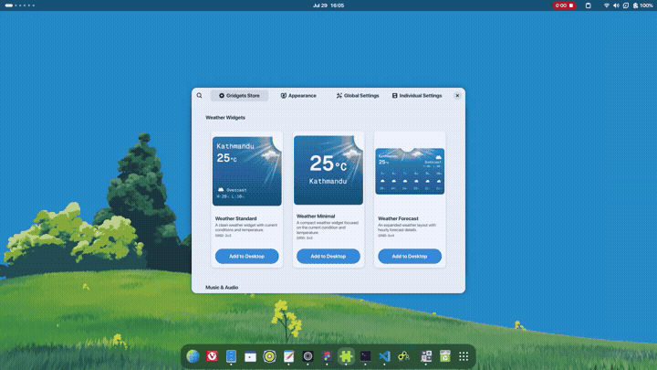
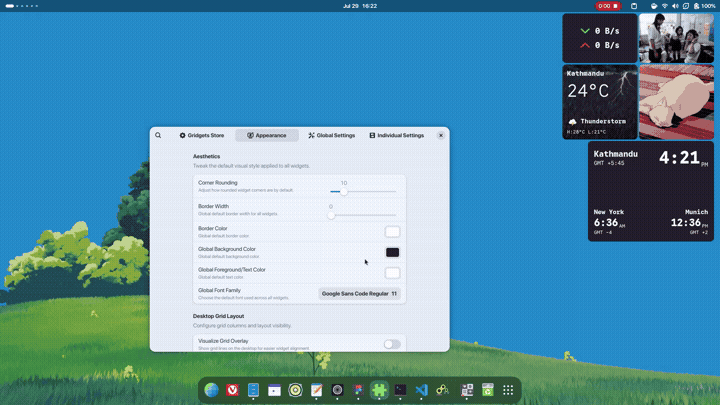
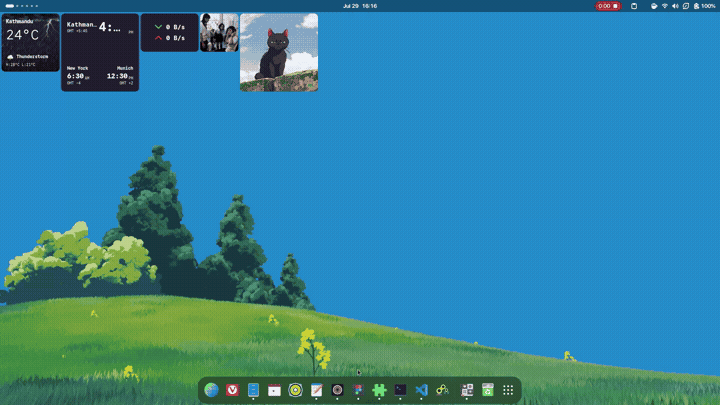

# Gridgets User Guide

## Widgets Overview

Gridgets offers **16 widgets** across five categories. Each widget lives on your desktop grid and can be moved, resized, and styled independently.

---

### Weather Widgets

Three layouts powered by the [Open-Meteo](https://open-meteo.com/) free API (no API key required). The city is configured when adding the widget. Data refreshes every 30 minutes.

| Widget | Thumbnail | Grid Size | Description |
|--------|-----------|-----------|-------------|
| **Weather Standard** |  | 3x3 | Current conditions, temperature, condition icon, high/low. Dynamic backgrounds change with weather/day-night. |
| **Weather Minimal** |  | 3x3 | Compact view with large temperature and city name. Ideal for a clean look. |
| **Weather Forecast** |  | 6x4 | Extended layout with 6-hour hourly forecast alongside current conditions. Dynamic backgrounds supported. |

*ℹ️ Weather widgets are not currently resizable; this is being worked on.*

---

### Music & Audio Widgets

Displays media playback from your system's MPRIS-compatible players (Spotify, Rhythmbox, etc.).

| Widget                  | Thumbnail                                         | Grid Size | Description                                                                         |
| -------------------------| ---------------------------------------------------| -----------| -------------------------------------------------------------------------------------|
| **Music Player**        |  | 4x4       | Square layout with album art and playback controls.                                 |
| **Music Player (Wide)** |  | 8x4       | Wide 2-panel layout with album art, track/artist/album info, and playback controls. |

---

### Time & Clock Widgets

Powered by GLib.DateTime (system clock). No external API needed.

| Widget | Thumbnail | Grid Size | Description |
|--------|-----------|-----------|-------------|
| **Time & Date** |  | 3x2 | Digital clock with current date. Supports 12h/24h format. Updates every minute, aligned to the minute boundary. |
| **World Clock** |  | 4x4 | Multi-city clock showing up to three timezones (primary large + two secondary). Supports 12h/24h format. |

---

### Media & Photos Widgets

| Widget | Thumbnail | Grid Size | Description |
|--------|-----------|-----------|-------------|
| **Image / GIF** |  | 2x2 | Display a static image or animated GIF from your filesystem. |
| **Image Slideshow** |  | 4x4 | Cycle through all images in a folder with crossfade transitions. Configurable interval (5–3600s). |

---

### System & Utilities Widgets

| Widget | Thumbnail | Grid Size | Description |
|--------|-----------|-----------|-------------|
| **System Dashboard** |  | 4x4 | All-in-one panel: CPU frequency, temperature, utilization, task count, upload/download speeds, and RAM usage bar. Reads `/proc/stat`, `/proc/meminfo`, `/proc/loadavg`, `/proc/cpuinfo`, `/proc/net/dev`, and `/sys/class/thermal/.../temp`. |
| **Pomodoro Timer** |  | 4x4 | Focus timer with work (25min), short break (5min), and long break (15min) cycles. Circular progress arc. Session counter (4 sessions before long break). *State is in-memory — resets on reload.* |
| **System Monitor** |  | 4x2 | CPU utilization and RAM usage displayed as circular arc gauges. |
| **Network Speed** |  | 3x2 | Live upload/download speed tracker reading `/proc/net/dev`. |
| **Quick Notes** |  | 4x4 | Markdown sticky note with bold, italic, headers, and checkbox support. Content is auto-saved on every keystroke to a JSON file at `notes/notes-<widgetId>.json`. |
| **Clipboard History** |  | 4x4 | Remembers your last 10 clipboard entries. Click any item to recopy it. History is persisted to `clipboard/clipboard-<widgetId>.json`. Polls the system clipboard every second. |
| **Command Launcher** | — | 2x2 | Desktop shortcut to run any bash command or script. Click to execute in a terminal. Configure a custom icon or image. |

---

## Adding Widgets (Store Page)

Open Gridgets preferences and navigate to the **Gridgets Store** tab.

Each widget is shown as a card with:
- **Thumbnail** — visual preview of what the widget looks like on your desktop.
- **Title & Description** — explains what the widget does.
- **Grid Size** — the default grid dimensions (e.g., 3x3).
- **Add to Desktop** button — click to instantly place the widget.

Widgets that need extra configuration (Image/GIF, Slideshow, World Clock, Command Launcher) will open a setup dialog before adding.

---

## Customizing Appearance (Appearance Page)

The **Appearance** tab in preferences controls the global look of all widgets.

### Aesthetics
- **Corner Rounding** — rounds the corners of all widget containers.
- **Border Width** — thickness of the border around each widget.
- **Border Colour** — pick any colour for widget borders.
- **Background Colour** — default background behind widget content.
- **Foreground Colour** — default text colour.
- **Font Family** — typeface used by text-based widgets.

### Desktop Grid Layout
- **Visualize Grid Overlay** — show grid lines on the desktop to help with alignment.
- **Custom Grid Size** — manually set the number of grid columns (default 28). The minimum is automatically computed to fit your current widgets without overlap.

---

## Desktop Interaction

Once widgets are on your desktop, you can interact with them directly:

### Moving
**Drag** any widget to reposition it. Widgets snap cleanly to the grid.

### Resizing
**Right-click** a widget and select **Resize**. A handle appears — drag to resize. Widgets snap to grid increments.

*ℹ️ Weather widgets are not yet resizable.*

### Right-Click Menu
Right-clicking a widget opens a context menu with:
- **Resize** — enter resize mode.
- **Delete Widget** — removes the widget and any associated data files (notes, clipboard history).
- **Individual Settings** — opens a per-widget settings panel to override global appearance (colour, font, border, etc.) for that specific widget.

### Individual Settings
Each widget can have its own style overrides:
- Background / foreground colour
- Font family
- Border radius & border width & border colour
- Type-specific options (e.g., 12h/24h for clocks, Fahrenheit for weather)
